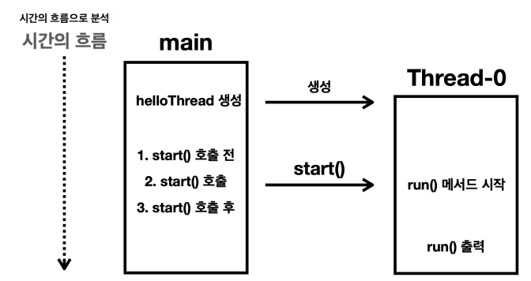

# 김영한의 실전 자바 - 고급 1편, 멀티스레드와 동시성

## Section002
### 멀티태스킹과 멀티프로세싱
#### 멀티태스킹
* 하나의 컴퓨터 시스템이 동시에 여러 작업을 수행하는 능력을 멀티태스킹
* 시분할 기법
  * 실행 시간을 분할해서 마치 동시에 실행되는 것 처럼 하는 기법
  * 대략 0.01초(10ms) 단위로 돌아가며 실행
* 참고) CPU에 어떤 프로그램이 얼마만큼 실행될지는 운영체제가 결정하는데 이것을 스케줄링이라고 한다.

#### 멀티프로세싱
* 둘 이상의 프로세서(CPU 코어)를 사용하여 여러 작업을 동시에 처리하는 기술
* 더 많은 작업을 처리 가능

#### 멀티태스킹 vs 멀티프로세싱
* 멀티태스킹
  * 여러 CPU(여러 CPU 코어)를 사용하여 동시에 여러 작업을 수행
  * 하드웨어 기반
* 멀티프로세싱
  * 단일 CPU(단일 CPU 코어)가 여러 작업을 동시에 수행하는 것처럼 보이게 하는 것
  * 소프트웨어 기반
* 참고) 
  * 
  * 여러 CPU 코어를 사용하기 때문에 멀티프로세싱이다. 동시에 각각의 단일 CPU 코어에 여러 작업을 분
    할해서 수행하기 때문에 멀티태스킹이다.

### 프로세스와 스레드
#### 프로세스
* 실행중인 프로그램을 프로
* 독립적인 메모리 공간, 운영체제에서 별도의 작업 단위로 분리해서 관리
* 메모리 구성
  * 코드 섹션: 실행할 프로그램의 코드가 저장되는 부분
  * 데이터 섹션: 전역 변수 및 정적 변수가 저장되는 부분(그림에서 기타에 포함)
  * 힙 (Heap): 동적으로 할당되는 메모리 영역
  * 스택 (Stack): 메서드(함수) 호출 시 생성되는 지역 변수와 반환 주소가 저장되는 영역(스레드에 포함)

#### 스레드
* 프로세스는 하나 이상의 스레드를 반드시 포함
* 메모리 구성
  * 공유 메모리: 같은 프로세스의 코드 섹션, 데이터 섹션, 힙(메모리)은 프로세스 안의 모든 스레드가 공유한다.
  * 개별 스택: 각 스레드는 자신의 스택을 갖고 있다.
* 프로그램 실행
  * 파일 덩어리가 메모리에 올려짐 → 프로세스
  * 프로세스 내의 코드를 한 줄씩 실행 → 스레드
* 멀티 스레드 필요한 이유
  * 하나의 프로그램도 그 안에서 동시에 여러 작업이 필요

### 스레드와 스케줄링
#### 단잌 코어 스케줄링

#### 멀티 코어 스케줄링

#### 프로세스, 스레드와 스케줄링
* 멀티태스킹
  * 동시에 여러 작업을 수행하는 것을 의미하며 이를 위해 운영체제는 스케줄링 기법을 사용한다.
* 프로세스와 스레드
  * 프로세스
    * 실행 중인 프로그램의 인스턴스
  * 스레드
    * 프로새스 내 실행되는 작은 단위
    * 실제로 CPU에 의해 실행되는 단위는 스레드
* 프로세스 역할
  * 실행 환경을 제공(컨테이너의 역할)
  * 프로세스 자체는 운영체제의 스케줄러에 의해 직접 실행되지 않으며, 프로세스 내의 스레드가 실행

### 컨텍스트 스위칭
#### 컨텍스트 스위칭
* 이전에 실행 중인 값을 메모리에 잠깐 저장하고, 이후에 다시 실행하는 시점에 저장한 값을 CPU에 다시 불러 오는 과정
* 멀티스레드는 대부분 효율적이지만, 컨텍스트 스위칭 과정이 필요하므로 항상 효율적인 것은 아니다

#### 적절한 스레드 개수
* cpu 바운드 작업: cpu 개수 + 1
* i/o 바운드 작업: CPU 코어 수 보다 많은 스레드를 생성, CPU를 최대한 사용할 수 있는 숫자까지 스레드 생성

---
## Section003
### 스레드 시작1
#### 자바 메모리 구조
* 메서드 영역
  * 클래스 정보, static 영역, 런타임 상수 풀
* 스택 영역
  * 지역변수, 중간 연산 결과, 메서드 호출 정보 포함
  * 각 스레드별로 하나의 실행 스택이 생성됨
* 힙 영역
  * 객체와 배열이 생성되는 영역
  * GC가 이루어지는 영역

#### 스레드 생성
* Runnable 인터페이스를 구현하는 방법
* Thread 클래스를 상속 받는 방법
  * run() 메서드 재정의
  * 다만 run()을 직접 호출할 일은 절대 없다. start()에 의해 호출된다.
* [예제] (src/thread/start/HelloThreadMain.java 확인)

  * main 스레드가 run() 메서드를 실행하는게 아니다.
    * main 스레드가 start()를 통해 Thread-0 스레드가 run()을 실행하도록 시킨다.
  * 스레드는 순서와 실행 기간을 모두 보장하지 않는다.

### 스레드 시작2
#### start() vs run()
* start() 대신에 재정의한 run() 메서드를 직접 호출하면?
  
  * main 스레드가 모든 것을 처리한다.
  *  별도의 스레드에서 재정의한 run() 메서드를 실행하려면, 반드시 start() 메서드를 호출해야 한다.

### 데몬 스레드
#### 데몬 스레드
* 사용자 스레드
  * 프로그램 주요 작업 수행
  * 작업이 완료될 때까지 실행
  * 모든 사용자 스레드가 종료되면 JVM도 종료
    * 데몬 스레드가 아닌 모든 스레드가 종료되면, 자바 프로그램도 종료된다.
* 데몬 스레드
  * 백그라운드에서 보조적인 역할 수행
  * 사용자 스레드가 종료되면 데몬 스레드는 자동으로 종료
* 참고) run() 메서드 안에서는 CheckedException을 반드시 잡아야 한다. 밖으로 던질 수 없다. 