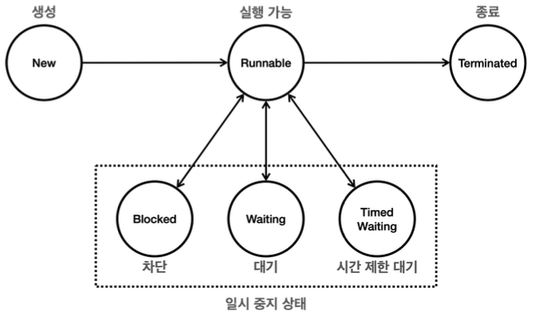

## Section044

### 스레드 기본 정보
#### 스레드 생성
* 스레드 이름
  * 스레드 생성 할 때 구현체와 이름 전달 가능
    ```java
    new Thread(new HelloRunnable(), "myThread");
    ```
  * 로깅용
  * 생략하는 경우 임의의 이름 생성

#### 스레드 ID
* threadId()
  * 스레드 고유 식별자 반환
  * 직접 지어 불가능

#### 스레드 이름
* getName()
  * 이름 반환
  * 중복 가능

#### 스레드 우선순위
* getPriority()
  * 우선 순위 반환
  * 스레드 스케줄러가 어떤 스레드를 우선 실행할지 결정하는 데 사용되지만 실제 실행 순서는 JVM 구현과 운영체제에 따라 달라질 수 있다.

#### 스레드 그룹
* getThreadGroup()
  * 스레드가 속한 스레드 그룹을 반환
* 부모 스레드
  * 새로운 스레드를 생성하는 스레드를 의미
  * 새로 생성된 스레드는 생성한 스레드를 부모로 간주한다.
* 직접적으로 사용할 일 없음. 그냥 알아만 두자!!

#### 스레드 상태
* NEW
  * 스레드가 아직 시작되지 않은 상태
  * 생성만 됨
* RUNNABLE
  * 스레드가 실행 중이거나 실행될 준비가 된 상태
* BLOCKED
  * 스레드가 동기화 락을 기다리는 상태
* WAITING
  * 스레드가 다른 스레드의 특정 작업이 완료되기를 기다리는 상태
* TIMED_WAITING
  * 일정 시간 동안 기다리는 상태
  * sleep()
* TERMINATED
  * 스레드가 실행을 마친 상태

### 스레드의 생명 주기 - 설명
#### 스레드의 상태


* NEW
  * 스레드가 생성되고 아직 시작되지 않음
  * Thread 객체 생성되었으나 start() 호출되지 않은 상태
* RUNNABLE
  * 실행 가능상태
  * 실행 + 실행 준비
  * 운영체제의 스케줄러가 각 스레드에 CPU 시간을 할당하여 실행하기 때문에, Runnable 상태에 있는 스레드는 스케줄러의 실행 대기열에 포함되어 있다가 차례로 CPU에서 실행된다. 
  * 운영체제 스케줄러의 실행 대기열에 있든, CPU에서 실제 실행되고 있든 모두 RUNNABLE 상태이다.
* 일시 중지 상태 (공식적인 명칭 아님...)
  * BLOCKED
    * 동기화 락을 얻기 위해 기다리는 상태
  * WAITING
    * 특정 작업이 완료되기를 무기한 기다리는 상태
  * TIMED_WAITING
    * 특정 시간 동안 다른 스레드의 작업이 완료되기를 기다리는 상태
* TERMINATED
  * 실행이 완료된 상태
  * 스레드는 한 번 종료되면 다시 시작할 수 없다.

#### 체크 예외 재정의
* 체크 예외
  * 부모 메서드가 체크 예외를 던지지 않는 경우, 재정의된 자식 메서드도 체크 예외를 던질 수 없다.
  * 자식 메서드는 부모 메서드가 던질 수 있는 체크 예외의 하위 타입만 던질 수 있다.
  * 자식 클래스가 더 넓은 범위의 예외를 던지면 해당 코드는 모든 예외를 제대로 처리하지 못할 수 있으며 이는 예외 처리의 일관성을 해치고, 예상하지 못한 런타임 오류를 초래할 수 있다.
* Runnable 인터페이스의 run() 메서드는 아무런 체크 예외를 던지지 않는다. 
  * 개발자는 반드시 체크 예외를 try-catch 블록 내에서 처리하게 된다. 이는 예외 발생 시 예외가 적절히 처리되지 않아서 프로그램이 비정상 종료되는 상황을 방지할 수 있다.
  * 하지만 이건 자바 초창기의 생각이며 최근에는 체크 예외보다는 언체크를 선호한다.


