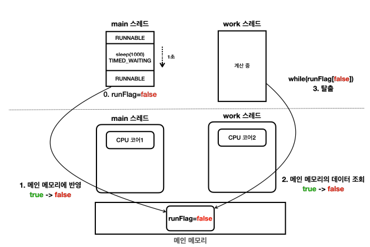
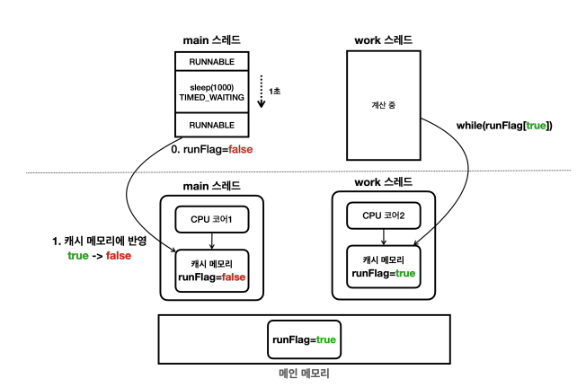

## Section06

### /volatile - 메모리 가시성
* 예상하는 프로그램 동작 방식
  
* 실제 프로그램이 동작 방식
  
  * 컴퓨터에는 캐시 메모리라는 것이 존재한다.
  * 빠른 연산을 위해 프로그램은 메인 메모리에 있는 데이터를 캐시 메모리로 불러들인다.
  * 스레드에서 아무리 값을 바꿔도 메인 메모리의 값이 바뀌는게 아니라 캐시 메모리의 데이터가 변하는 것이다.
    * 그리고 캐시 메모리의 값은 메인 메모리에 즉시 반영되지 않는다.
* 캐시 메모리를 메인 메모리에 반영하거나, 메인 메모리의 변경 내역을 캐시 메모리에 다시 불러오는 정확한 시점을 알 수는 없다.
  * 다만 주로 컨텍스트 스위칭이 될 때, 캐시 메모리도 함께 갱신되지만 이 역시도 환경에 따라 다를 수 있다.